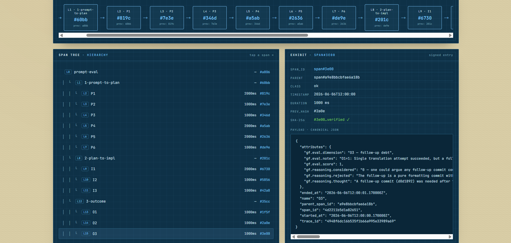
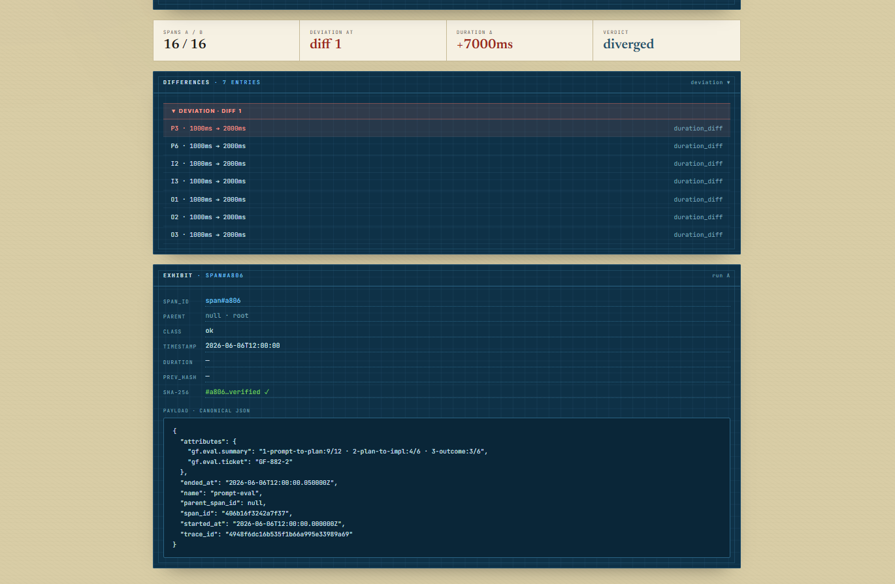

<p align="center">
  
</p>

<p align="center">
  <em>Every agent leaves a record.&nbsp; We keep it.</em>
</p>

<p align="center">
  
</p>

---

Span Chain treats the **agent session** as the unit of analysis — not the individual LLM call.
The entire run, with its parent/child span hierarchy intact, is recorded to an
**immutable, hash-chain–verified ledger** as the source of truth.

Re-run a recorded session and you get the **same chain every time**.
Silent failures — HTTP 200, wrong answer — become inspectable instead of irreproducible.

---

## How Span Chain compares

| | LangSmith / Langfuse | Span Chain |
|---|---|---|
| **Purpose** | Developer debug, visualization | Production auditability, integrity |
| **Traces** | Mutable, vendor-controlled | Append-only, hash-chained |
| **Replay** | Re-runs LLM ($) | Cassette replay ($0) |
| **Evidence** | Logs | Cryptographic verification |
| **Hosting** | Vendor SaaS | Self-hosted, MIT |

**LangSmith** is built for development debugging and trace visualization.
**Span Chain** is built for production auditability and tamper-evident evidence.

**Langfuse** is built for tracing and analytics.
**Span Chain** is built for cryptographic verification and deterministic
replay without LLM calls.

If you are targeting EU AI Act compliance, Span Chain's tamper-evident
ledger provides the audit trail standard required for Article 12.

> They show you what happened. We keep the proof.

---

## How it works

<p align="center">
  
</p>

Each entry in the ledger contains a SHA-256 hash of the previous entry.
Tampered records and dropped epochs are **detectable**, not assumed away.

---

## See it in action

<p align="center">
  
</p>

<p align="center">
  <sub>The <b>Trail</b> — a run's full span tree, every entry hash-chain verified, with the agent's own reasoning captured inline.</sub>
</p>

<p align="center">
  
</p>

<p align="center">
  <sub><b>Evals compare</b> — a structural span-tree diff pinpoints the exact span where two runs diverge.</sub>
</p>

---

## Properties

<table align="center">
  <tr>
    <td align="center" width="260">
      <br>
      <b>Verified</b><br>
      <sub>Every entry cryptographically linked to the last</sub>
    </td>
    <td align="center" width="260">
      <br>
      <b>Deterministic Replay</b><br>
      <sub>Same session → identical chain, always</sub>
    </td>
    <td align="center" width="260">
      <br>
      <b>Tamper Detection</b><br>
      <sub>Dropped epochs and mutations surface automatically</sub>
    </td>
  </tr>
</table>

---

## Architecture

<p align="center">
  
</p>

```
SDK (OTLP / JSON)
  → Ingest  (normalize, span tree)
    → Hash-Chain Ledger  (source of truth · immutable · verifiable)
      ├── Deterministic Replay
      ├── Evals & Compare
      └── Audit Trail
```

---

## Quickstart

Requires Docker Compose v2 and a `.env` file:

```bash
git clone https://github.com/ghostfactory-art/spanchain.git
cd spanchain
cp .env.example .env
# Edit .env — set POSTGRES_PASSWORD, GF_API_KEY, and SECRET_KEY_BASE
docker compose up
```

UI at **http://localhost** · Ingest API at **http://localhost/ingest**

**Send a trace (OTLP/HTTP JSON):**

```bash
curl -X POST http://localhost/v1/traces \
  -H "Content-Type: application/json" \
  -H "Authorization: Bearer $SPANCHAIN_KEY" \
  -d @your-trace.json
```

Or use the plain JSON endpoint at `http://localhost/ingest` — no OTLP SDK required.

---

## SDKs

Both SDKs ship in this repo and speak OTLP/HTTP JSON natively.

**Python:**

```bash
pip install ./sdk/python
```

**TypeScript:**

```bash
npm install ./sdk/typescript
```

Usage examples in [`sdk/python/README.md`](sdk/python/README.md) and
[`sdk/typescript/README.md`](sdk/typescript/README.md).

---

## Status

Active development · launching soon.

A **[GhostFactory](https://ghostfactory.art)** product — [spanchain.art](https://spanchain.art)

---

## Known Issues

**TLS certificate (localhost):** With the default `DOMAIN=localhost`, Caddy terminates HTTPS
using its own local CA, so on first run your browser shows an SSL warning and `curl` fails with
a certificate error. Trust the local CA once:

```bash
docker compose exec caddy caddy trust
```

Restart the browser afterwards (on Windows/Docker Desktop this is usually required; on WSL2 you can
confirm the cert landed in `/etc/ssl/certs/`). To skip trusting, bypass per-request instead —
`curl --insecure` or click through the browser's "advanced" warning. Not needed when `DOMAIN` is a
real domain (Caddy uses Let's Encrypt).

**Windows (WSL2):** Line endings in `entrypoint.sh` — if the container exits with
`exec format error`, run `dos2unix entrypoint.sh` before building.

**macOS (Apple Silicon):** Untested. Should work via Docker Desktop ARM emulation.

**Linux:** Untested. Standard `docker compose up` expected to work.

---

## License

MIT — see [LICENSE](LICENSE).
