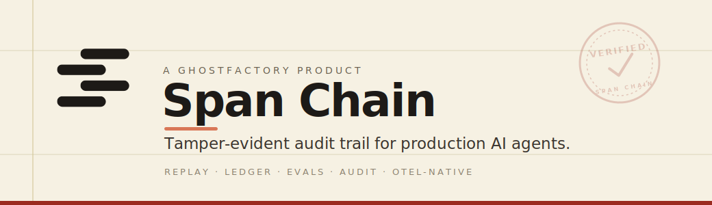
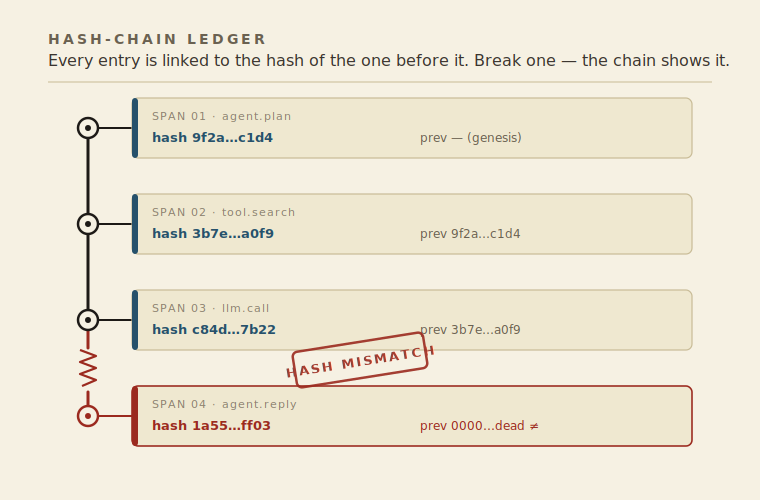
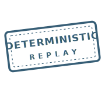
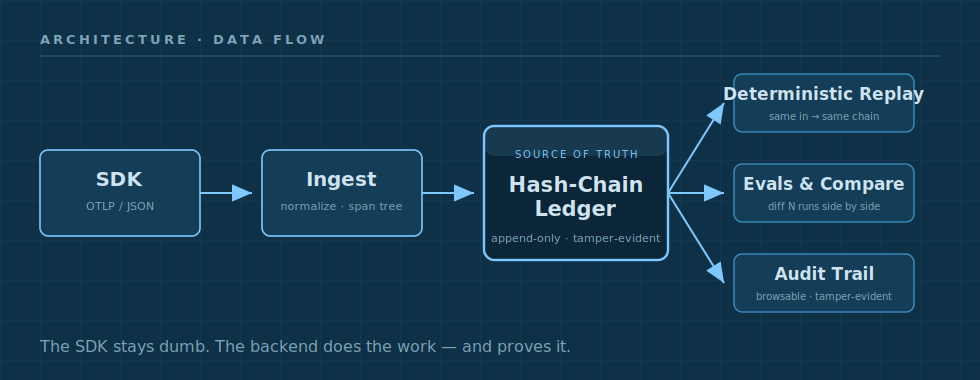

<p align="center">
  
</p>

<p align="center">
  <em>Every agent leaves a record.&nbsp; We keep it.</em>
</p>

<p align="center">
  
</p>

---

Span Chain treats the **agent session** as the unit of analysis — not the individual LLM call.
The entire run, with its parent/child span hierarchy intact, is recorded to an
**immutable, hash-chain–verified ledger** as the source of truth.

Re-run a recorded session and you get the **same chain every time**.
Silent failures — HTTP 200, wrong answer — become inspectable instead of irreproducible.

---

## How it works

<p align="center">
  
</p>

Each entry in the ledger contains a SHA-256 hash of the previous entry.
Tampered records and dropped epochs are **detectable**, not assumed away.

---

## Properties

<table align="center">
  <tr>
    <td align="center" width="260">
      <br>
      <b>Verified</b><br>
      <sub>Every entry cryptographically linked to the last</sub>
    </td>
    <td align="center" width="260">
      <br>
      <b>Deterministic Replay</b><br>
      <sub>Same session → identical chain, always</sub>
    </td>
    <td align="center" width="260">
      <br>
      <b>Tamper Detection</b><br>
      <sub>Dropped epochs and mutations surface automatically</sub>
    </td>
  </tr>
</table>

---

## Architecture

<p align="center">
  
</p>

```
SDK (OTLP / JSON)
  → Ingest  (normalize, span tree)
    → Hash-Chain Ledger  (source of truth · immutable · verifiable)
      ├── Deterministic Replay
      ├── Evals & Compare
      └── Audit Trail
```

---

## Quickstart

Requires Docker Compose v2 and a `.env` file:

```bash
git clone https://github.com/ghostfactory-art/spanchain.git
cd spanchain
cp .env.example .env
# Edit .env — set POSTGRES_PASSWORD, GF_API_KEY, and SECRET_KEY_BASE
docker compose up
```

UI at **http://localhost** · Ingest API at **http://localhost/ingest**

**Send a trace (OTLP/HTTP JSON):**

```bash
curl -X POST http://localhost/v1/traces \
  -H "Content-Type: application/json" \
  -H "Authorization: Bearer $SPANCHAIN_KEY" \
  -d @your-trace.json
```

Or use the plain JSON endpoint at `http://localhost/ingest` — no OTLP SDK required.

---

## Status

Active development · launching soon.

A **[GhostFactory](https://ghostfactory.art)** product — [spanchain.art](https://spanchain.art)

---

## Known Issues

**Windows (WSL2):** Line endings in `entrypoint.sh` — if the container exits with
`exec format error`, run `dos2unix entrypoint.sh` before building.

**macOS (Apple Silicon):** Untested. Should work via Docker Desktop ARM emulation.

**Linux:** Untested. Standard `docker compose up` expected to work.

---

## License

MIT — see [LICENSE](LICENSE).
