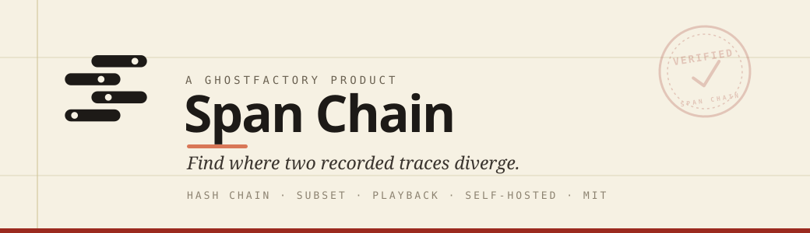
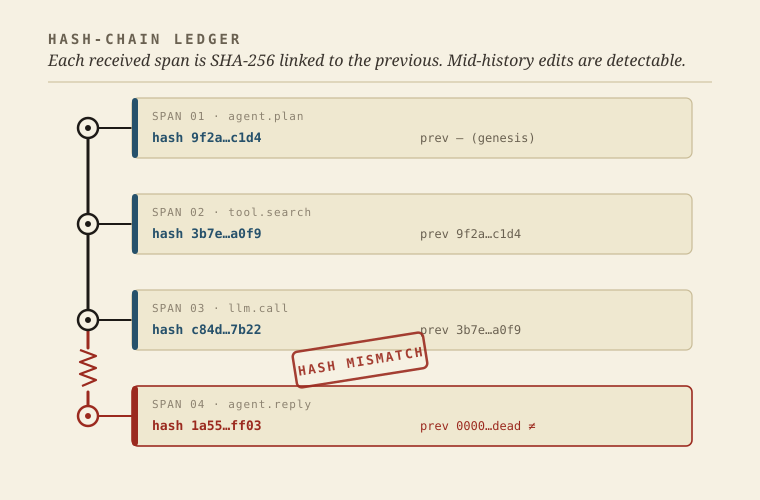
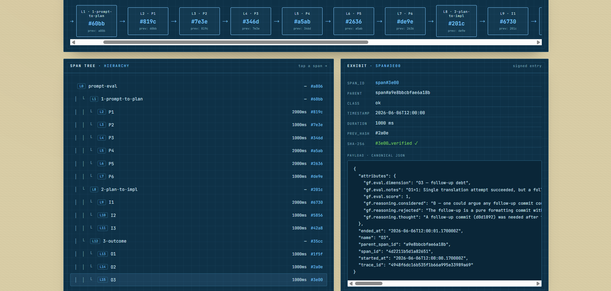
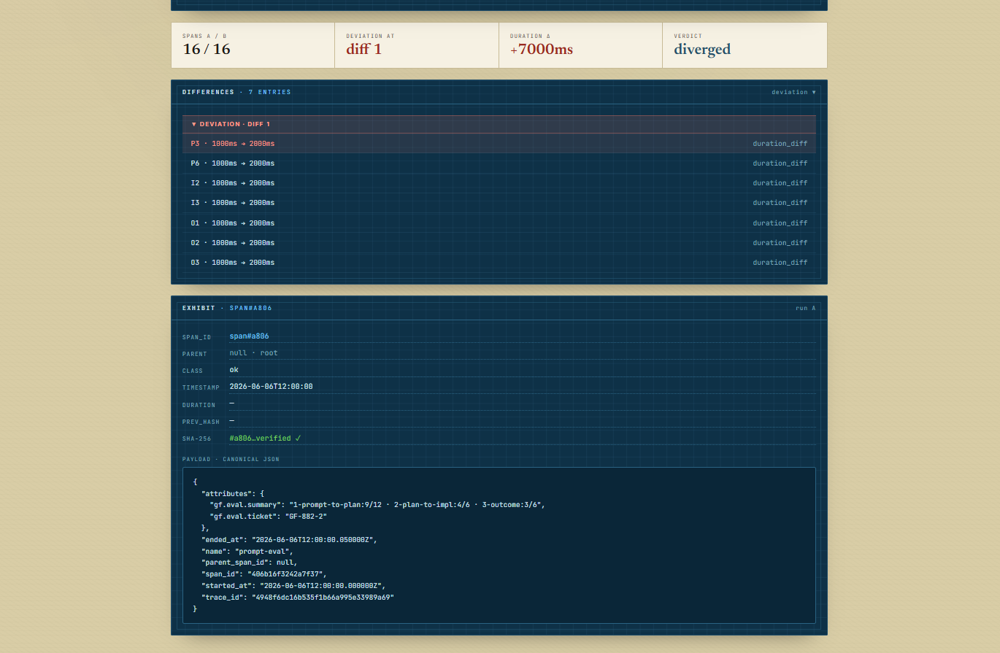
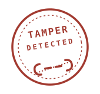
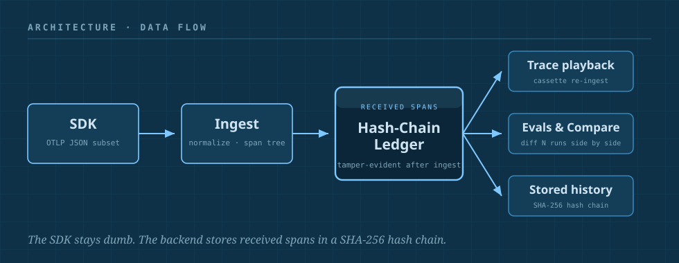

<p align="center">
  
</p>

<p align="center">
  <em>Find where two recorded traces diverge.</em>
</p>

<p align="center">
  
</p>

<p align="center">
  <em>Span Chain is a self-hosted trace recorder and structural regression-diff layer for AI agents.</em>
</p>

---

**Span Chain supports an OTLP/HTTP JSON subset.**

**Compare agent configuration — structure and config.**

**Trace playback / cassette re-ingest. Not agent replay.**

**Tamper-evident after ingest.**

Span Chain stores received spans in a SHA-256 hash chain. Re-verification can detect edits, reordering, and gaps in the middle of that stored history. It cannot detect spans that were never received, spans removed from the end, or a chain rebuilt by the server operator.

MIT. Self-hosted. A GhostFactory product.

---

## How Span Chain compares

| | LangSmith / Langfuse | Span Chain |
|---|---|---|
| **Purpose** | Developer debug, visualization | Trace recorder + structural regression-diff |
| **Traces** | Mutable, vendor-controlled | SHA-256 hash chain of received spans |
| **Playback** | Re-runs the agent / LLM | Trace playback / cassette re-ingest. Not agent replay. |
| **Integrity** | Logs | Tamper-evident after ingest |
| **Hosting** | Vendor SaaS | Self-hosted, MIT |
| **Architecture** | Stateless Python API | Elixir/OTP per-run isolation |

**LangSmith** is built for development debugging and trace visualization.
**Span Chain** is a self-hosted trace recorder and structural regression-diff layer for AI agents.

**Langfuse** is built for tracing and analytics.
**Span Chain** records received spans and compares agent configuration — structure and config.

**Elixir/OTP per-run isolation** — each recorded run gets its own supervised process;
a crash in one run does not take down another.

---

## How it works

<p align="center">
  
</p>

Each stored entry contains a SHA-256 hash of the previous entry.
Re-verification can detect edits, reordering, and gaps in the middle of that stored history.

---

## See it in action

<p align="center">
  
</p>

<p align="center">
  <sub>The <b>Trail</b> — a run's span tree, with the agent's own reasoning captured inline.</sub>
</p>

<p align="center">
  
</p>

<p align="center">
  <sub><b>Evals compare</b> — Find where two recorded traces diverge.</sub>
</p>

---

## Properties

<table align="center">
  <tr>
    <td align="center" width="260">
      <br>
      <b>Hash-linked</b><br>
      <sub>Each received span is SHA-256 linked to the last</sub>
    </td>
    <td align="center" width="260">
      <br>
      <b>Trace playback</b><br>
      <sub>Trace playback / cassette re-ingest. Not agent replay.</sub>
    </td>
    <td align="center" width="260">
      <br>
      <b>Tamper-evident after ingest</b><br>
      <sub>Mid-history edits, reordering, and gaps are detectable</sub>
    </td>
  </tr>
</table>

---

## Architecture

<p align="center">
  
</p>

```
SDK (OTLP/HTTP JSON subset)
  → Ingest  (normalize, span tree)
    → Hash-Chain Ledger  (received spans)
      ├── Trace playback / cassette re-ingest
      ├── Compare (structure and config)
      └── Stored history
```

---

## Quickstart

Requires Docker Compose v2 and a `.env` file:

```bash
git clone https://github.com/ghostfactory-art/spanchain.git
cd spanchain
cp .env.example .env
# Edit .env — set POSTGRES_PASSWORD, GF_API_KEY, and SECRET_KEY_BASE
docker compose up
```

UI at **http://localhost** · Ingest API at **http://localhost/ingest**

**Send a trace (OTLP/HTTP JSON subset):**

```bash
curl -X POST https://localhost/v1/traces --insecure \
  -H "Content-Type: application/json" \
  -H "Authorization: Bearer $SPANCHAIN_KEY" \
  -d @your-trace.json
```

> **TLS:** default Docker setup uses a local CA — add `--insecure` to skip, or trust once
> via `caddy trust`. See [Known Issues](#known-issues) for details.

Or use the plain JSON endpoint at `http://localhost/ingest` — no OTLP SDK required.

Works with **LangChain, CrewAI, LlamaIndex, AutoGen, and Pydantic AI**
via an OTLP/HTTP JSON subset — no framework-specific SDK required.

---

## OTLP Compatibility

Span Chain supports an OTLP/HTTP JSON subset (`POST /v1/traces`).
Missing fields are ignored without being stored (`lossy-but-visible` per ADR-004).

### Attribute value types

| OTLP type     | Span Chain behavior             |
|---------------|---------------------------------|
| `stringValue` | stored as string                |
| `intValue`    | stored as integer               |
| `boolValue`   | stored as boolean               |
| `doubleValue` | stored as float                 |
| `arrayValue`  | JSON-stringified string         |
| `kvlistValue` | JSON-stringified string         |

### Required resource attribute

`service.instance.id` **must** be present — it maps to `run_id`.
Missing → HTTP 400 `missing_run_id`.

```json
{
  "resourceSpans": [{
    "resource": {
      "attributes": [{
        "key": "service.instance.id",
        "value": { "stringValue": "my-agent-run-001" }
      }]
    },
    ...
  }]
}
```

### What is ignored

- `events`, `links` — not stored
- scope attributes — not stored (resource + span attributes only)
- `traceState`, `droppedAttributesCount` — not stored

### HTTP response

Successful ingest → HTTP **200** + `{"partialSuccess":{"rejectedSpans":0}}`.
(Not 202 — that status is returned only by the `/ingest` endpoint.)

### OTel Collector bridge

Have a standard OTel SDK that cannot set `service.instance.id`?
Use an OTel Collector as a bridge:

```yaml
# OTel Collector bridge → Span Chain
# Maps service.name → service.instance.id (run_id carrier for Span Chain)
receivers:
  otlp:
    protocols:
      http:
        endpoint: "0.0.0.0:4318"

processors:
  transform/spanchain:
    trace_statements:
      - context: resource
        statements:
          - set(attributes["service.instance.id"], attributes["service.name"])

exporters:
  otlphttp/spanchain:
    endpoint: "https://your-spanchain-instance/v1/traces"
    headers:
      Authorization: "Bearer ${env:GF_API_KEY}"

service:
  pipelines:
    traces:
      receivers: [otlp]
      processors: [transform/spanchain]
      exporters: [otlphttp/spanchain]
```

---

## SDKs

Both SDKs ship in this repo and speak an OTLP/HTTP JSON subset — see [OTLP Compatibility](#otlp-compatibility).

**Python:**

```bash
pip install ./sdk/python
```

**TypeScript:**

```bash
npm install ./sdk/typescript
```

Usage examples in [`sdk/python/README.md`](sdk/python/README.md) and
[`sdk/typescript/README.md`](sdk/typescript/README.md).

---

## Status

v0.61.0 · launched June 2026 · active development.

A **[GhostFactory](https://ghostfactory.art)** product — [spanchain.dev](https://www.spanchain.dev/)

---

## What is public

By default, `/trail` and `/eval/:id` are accessible without authentication.
These views expose metadata: run IDs, span names, timing, and agent config diffs
(`gf.agent.*` attributes). **Span payloads remain token-gated** (`GF_API_KEY`).

For internet-facing or shared instances, set `TRAIL_AUTH_ENABLED=true` in `.env`.
This enables HTTP Basic Auth on Trail/Eval views (password = `GF_API_KEY`).

---

## Known Issues

**TLS certificate (localhost):** With the default `DOMAIN=localhost`, Caddy terminates HTTPS
using its own local CA, so on first run your browser shows an SSL warning and `curl` fails with
a certificate error. Trust the local CA once:

```bash
docker compose exec caddy caddy trust
```

Restart the browser afterwards (on Windows/Docker Desktop this is usually required; on WSL2 you can
confirm the cert landed in `/etc/ssl/certs/`). To skip trusting, bypass per-request instead —
`curl --insecure` or click through the browser's "advanced" warning. Not needed when `DOMAIN` is a
real domain (Caddy uses Let's Encrypt).

**Windows (WSL2):** Line endings in `entrypoint.sh` — if the container exits with
`exec format error`, run `dos2unix entrypoint.sh` before building.

**macOS (Apple Silicon):** Untested. Should work via Docker Desktop ARM emulation.

**Linux:** Untested. Standard `docker compose up` expected to work.

---

## License

MIT — see [LICENSE](LICENSE).
